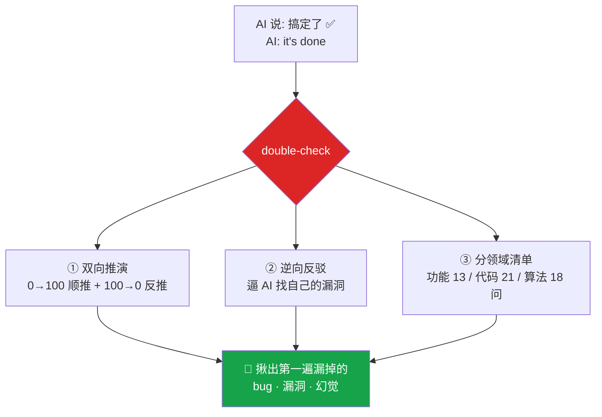

<div align="center">

# 🔁 double-check

### 你的 AI 说"搞定了"。让它证明给你看。
### Your AI says "done." Make it prove it.

**逼 AI 把自己刚做的事往死里复盘一遍,揪出它第一遍没看见的 bug、漏洞、幻觉。**
**Force the AI to review its own work — catch the bugs, holes & hallucinations it missed.**

[](LICENSE)
[](https://code.claude.com/docs/en/skills)
[](https://agentskills.io)
[](#)
[](https://github.com/LouisLin0723/double-check/stargazers)

</div>

---

## 😤 痛点:AI 一定有幻觉,而且它"看不全" / The Problem

每个用 AI 写代码的人都中过招:AI 信誓旦旦说"**搞定了**",结果一跑全是 bug。这不是它态度差,是模型的**先天限制** —— 它有**幻觉率 (hallucination)**,而且**一次看不全**。

> **把 AI 想象成一个只有两只眼睛的人。**
> 它盯着面前这 **1,000 个文件**,就只能看到这 1,000 个。
> 但真正的 bug,往往**不在**它眼皮底下这 1,000 个里 ——
> 而是藏在它**没加载进来的另外 99,000 个文件**里。
> 整个项目有 **10 万个文件**,没有任何 AI 能一口气全看完。
> 它看了 **1%** 就敢喊"搞定了",剩下 **99% 的雷**,它根本没瞧见。

> *Picture the AI as a person with only two eyes. Staring at the 1,000 files in front of it, it sees only those 1,000. The real bugs are hiding in the **other 99,000 files it never loaded**. It says "done" after seeing **1%** — and 99% of the landmines were never in view.*

## ✅ 解法 / The Fix

`double-check` = 再花一点 token,**逼 AI 回头把自己刚做的事仔细复盘一遍**。靠这套**亲测有效**的提示词,它能再揪出一大批第一遍漏掉的洞。



复盘消不掉幻觉(没人能),但能把 AI 的**严谨度实打实再顶高一档**。

## 🔬 真实示例 / Worked example

你让 Claude 写个「取数组中位数」的函数,它给你:

```js
function median(arr) {
  arr.sort((a, b) => a - b);
  return arr[Math.floor(arr.length / 2)];
}
```

> Claude:"搞定了 ✅"

你打 `2`。double-check 用代码清单逼它复盘自己,当场揪出 **3 个它第一遍没看见的洞**:

- 🐛 **边界(偶数长度)** — 偶数个元素时返回的是中间偏右那个,不是真中位数(该取中间两数的平均)
- 🐛 **互相污染** — `arr.sort()` 原地改了调用者传进来的数组,留下副作用
- 🐛 **空输入** — `median([])` 返回 `undefined`,根本没处理

第一遍那句"搞定了"漏了 3 个 bug。这就是 double-check 的价值 —— **把"看了 1% 就喊完成"逼成"再查一遍"。**

> *Ask Claude for a `median()` function and it confidently ships one with three bugs: even-length midpoint, in-place `sort()` side-effect, and an empty-array crash. Hit `2` — double-check's checklist surfaces all three. That's the point.*

## 🎯 怎么用 / How to use

复盘是核心,触发它只要一个动作:

| 你做什么 | 会发生 |
|---|---|
| 打 `2`,或说"复盘 / double-check / 审一遍 / 有没有问题" | AI 立刻进入严格复盘:双向推演 + 逆向反驳 + 分领域清单 |
| 涉钱 / 不可逆 / 重大决策 | **自动**触发复盘,不用你喊 |

> 附带 **1 / 2 / 3 快捷键工作流**:`1`=干到底、`2`=复盘(核心)、`3`=上线收尾。快捷键是辅助,复盘才是主角。完整方法论见 [`SKILL.md`](skills/double-check/SKILL.md)。

## 📦 安装 / Install

**A. Plugin 一键装(推荐):**
```
/plugin marketplace add LouisLin0723/double-check
/plugin install double-check@double-check
```

**B. 手动 clone:**
```bash
git clone https://github.com/LouisLin0723/double-check.git
cp -r double-check/skills/double-check ~/.claude/skills/
```

重启 Claude Code 生效。

## 🧠 为什么有效 / Why it works

1. **对抗 AI 的讨好倾向** — AI 默认说"好了"。`double-check` 强制它反向找茬,戳穿"虚假完成"。
2. **逼它看视野外的雷** — 双向 + 逆向 + 清单,逼它跳出"眼前这 1000 个文件",去查它第一遍没看的地方。
3. **便宜的检查 vs 昂贵的事故** — 复盘花几千 token,漏一个 bug 上线花几小时排查。稳赚。

## 🔧 自定义 / Customize

复盘清单 + 快捷键是作者的工作流约定。Fork 它,改 [`SKILL.md`](skills/double-check/SKILL.md) 里的触发词、检查清单、部署命令,换成你自己的节奏。

> 不绑定任何框架 —— 一套**可迁移的复盘骨架**。
> *Framework-agnostic. A portable self-review skeleton.*

## 📄 License

MIT © [Louis Lin](https://github.com/LouisLin0723)

---

<div align="center">

**每天被 AI 的"搞定了"坑过? 点个 ⭐ Star,下次让它先 double-check ❤️**
**Tired of your AI's fake "done"? Drop a ⭐ — make it double-check next time.**

</div>
